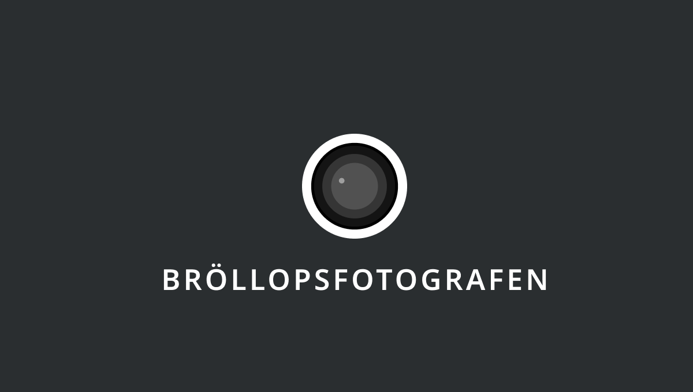
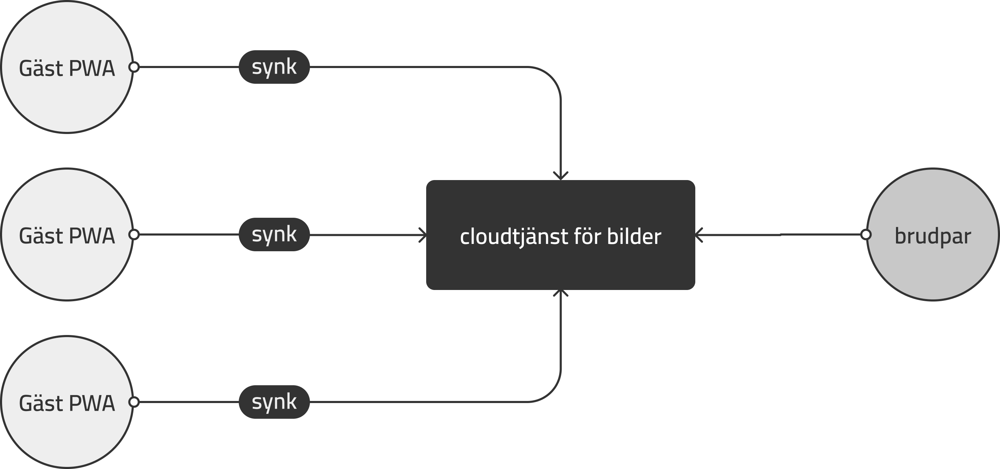

# Bröllopsfotografen

## Bakgrund
Bröllop är för de flesta som gifter sig en fantastisk dag sprängfylld med glädje och känslor. Så till den milda grad att de inte riktigt går att ta in allt där och då på en gång. Då är det tur kameran är uppfunnen, som möjliggör fångadet av ögonblick och minnen för livet.

En välsignelse och en utmaning vi står inför idag är att alla har sina egna kameror via telefonen. Välsignelsen är att massor av bilder blir tagna som förevigar dagen. Utmaningen är att bilderna oftast förblir på gästernas telefoner och kommer inte brudparet till.

## Uppdrag
Här kommer tjänsten **bröllopsfotografen** in. Bröllopsfotografen är en *kollektiv kamera* redo att dokumentera en tillställning från gästernas alla olika perspektiv. Bildernas samlas sen i en molntjänst och kan njutas av brudparet.

**Som nyanställd, cutting-edge frontendutvecklare på Bröllopsfotografen AB så är det det ditt uppdrag att ta fram Gäst PWAn.**

Du har fått en mockup att följa från designern. Den hittar du [här](https://www.figma.com/proto/6s8LlGshGOkufkBNV5OzXi/PWA-Br%C3%B6llopsfotografen?node-id=1%3A52&scaling=scale-down&page-id=0%3A1&starting-point-node-id=1%3A19).

## Tekniska krav
- installerbar med ikon
- offline capable
- mediaDevices API
- spara fotade bilder i localStorage
- vid onlineläge, synka bilddatan mot jsonbin ( VG )

## Level up
Om du vill utmana dig extra mycket så kan du lägga till redigeringsmöjligheter på din fångade bild via [canvas filter](https://github.com/zhengsk/ImageFilters.js).

## Bedömning
För *Godkänt* i kursen skall en Gäst PWA som möter de tekniska kraven framställas och lämnas in.

För *Väl godkänt* ska dina bilder synka mot någon moln-batabas, ex. [JSONbin](https://jsonbin.io/).

## Inlämning 
Inläming sker enklast via klonat Github-repo och sedan meddela någon av lärarna via mail eller discord.